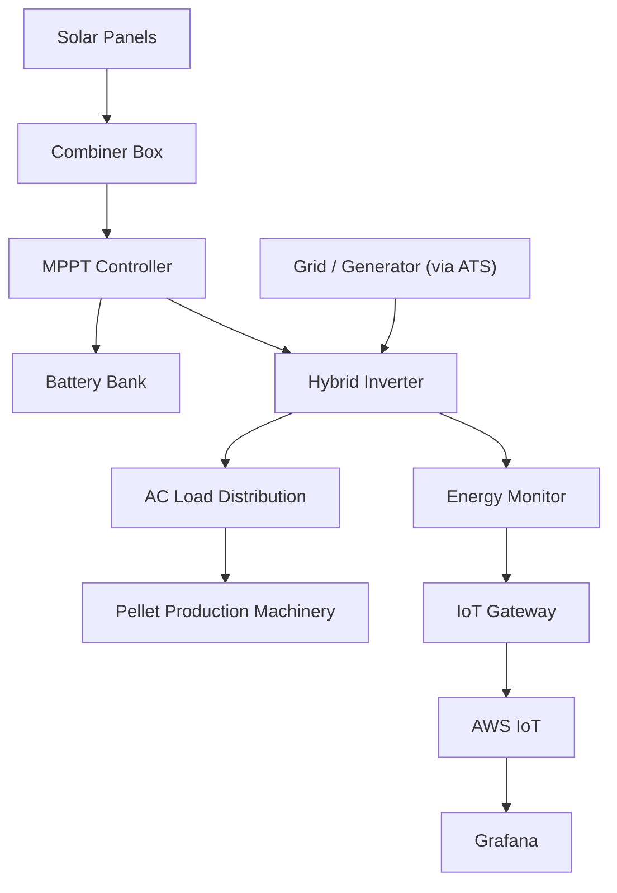
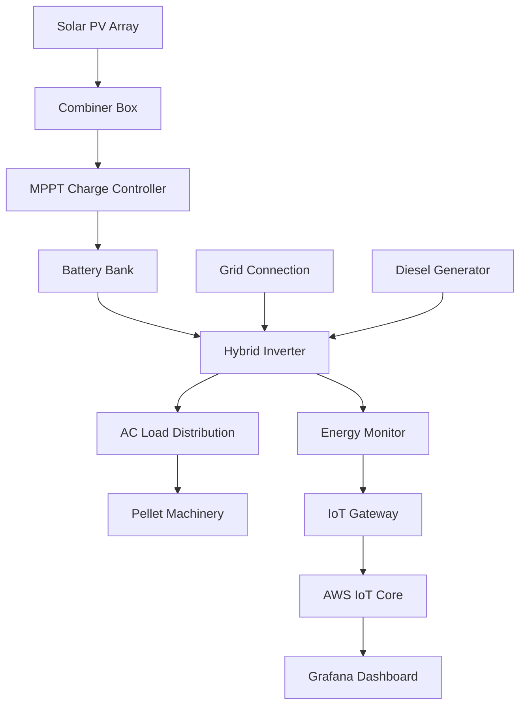
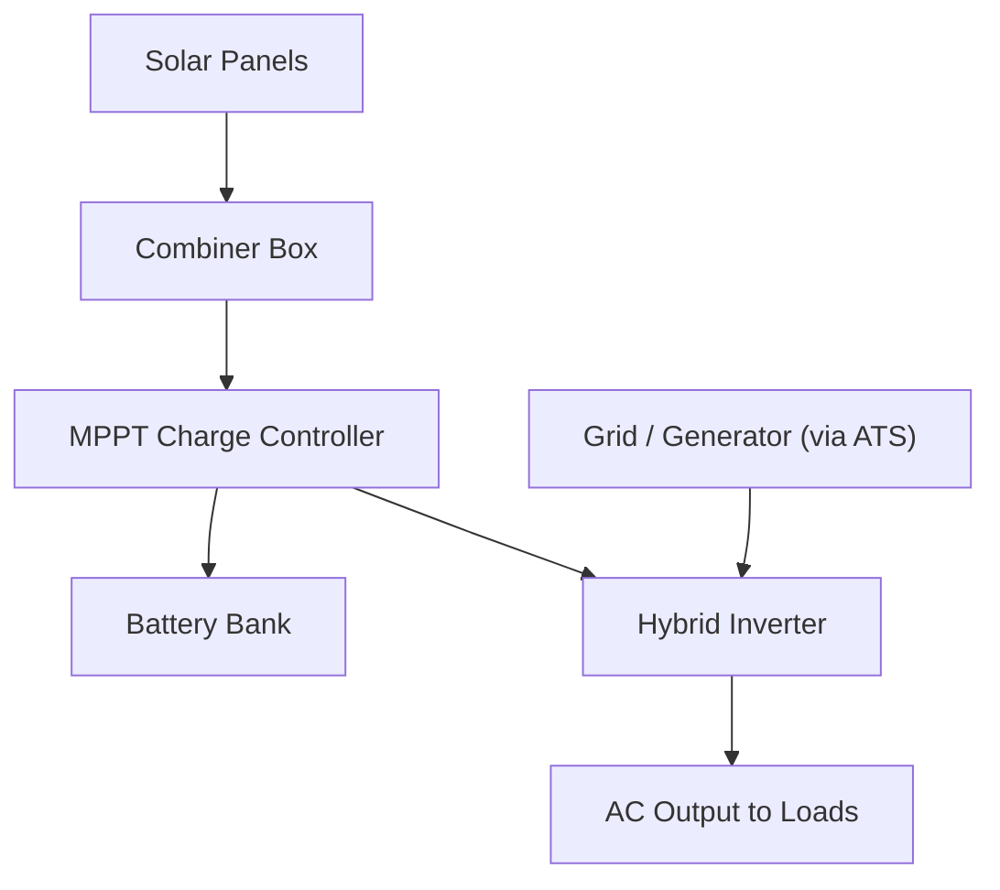
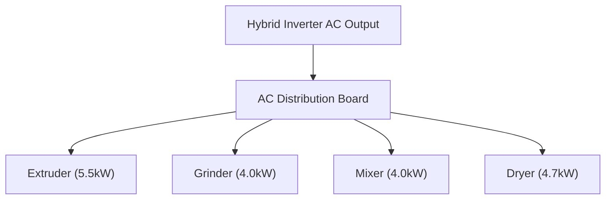

# Solar Hybrid Inverter System Schematic Layout

## Overview
This schematic layout outlines the interconnection of components for a solar hybrid inverter system designed to power a fish feed pellet production facility. The system supports machinery with a total rated load of approximately 18.2 kW.

## System Components

1. **Solar PV Array (30 kW)**
   - 60 × 500 W Mono/Polycrystalline panels
   - Configured in series-parallel to match inverter input voltage

2. **MPPT Charge Controller (Optional if not integrated)**
   - Rated for total PV output current
   - Manages DC input from panels to batteries

3. **Hybrid Inverter (20 kW)**
   - Pure sine wave output
   - Integrated MPPT, battery, and grid interface
   - AC output for load distribution

4. **Battery Bank (40 kWh)**
   - 8 × 48 V lithium-ion batteries (200Ah each)
   - Connected in parallel/series as needed
   - Fused battery interconnects

5. **AC Load Distribution Box**
   - Circuit breakers for each machine:
     - Extruder (5.5 kW)
     - Grinder (4.0 kW)
     - Mixer (4.0 kW)
     - Dryer (4.7 kW)
   - Surge protection device (SPD)

6. **ATS / Changeover Switch**
   - Select between Solar/Grid/Diesel input
   - Ensures seamless transition during outages

7. **Diesel Generator (Optional Backup)**
   - Minimum 20 kVA
   - Connected via ATS

8. **Grid Connection**
   - Integrated into ATS
   - Used when solar or batteries are low

9. **Monitoring & IoT Dashboard**
   - Smart energy meters (RS485/Modbus to Wi-Fi)
   - Data logger connected to AWS IoT Core
   - Visualisation via Grafana dashboard

## Wiring Flow (Simplified)

## Diagram Sketches

### Basic System Block Diagram (TD Flowchart Style)

### 🔌 Solar-Battery-Inverter Wiring Layout

### ⚙️ Load Distribution Sketch

> **Note:** Replace the image URLs with your actual hosted diagram links or relative paths in your project repository.

## Notes
- Ensure all DC wiring is properly fused.
- Use appropriate DC isolators and surge protection.
- Battery management system (BMS) must be integrated for lithium-ion.
- Monitoring gateway must include cellular or Wi-Fi fallback.
- Inverter must be programmed for priority: Solar → Battery → Grid → Generator.

---

Would you like a BOM table added here with model suggestions and prices?
